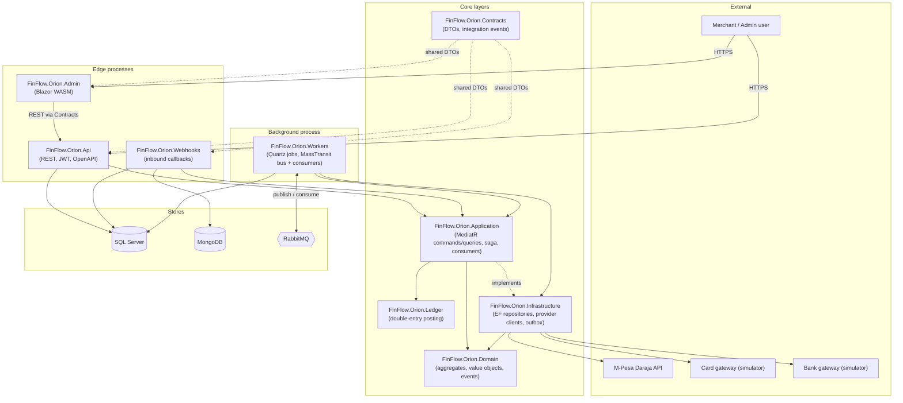
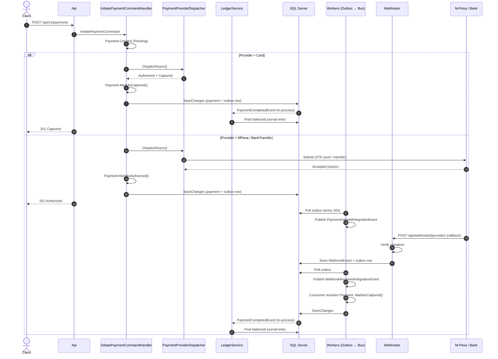
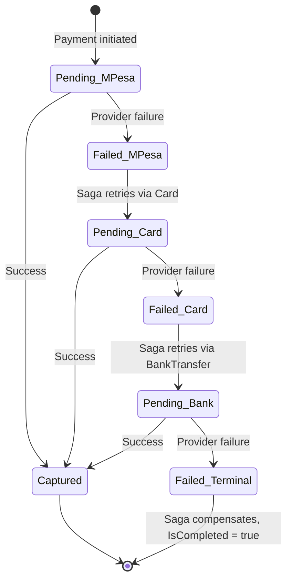
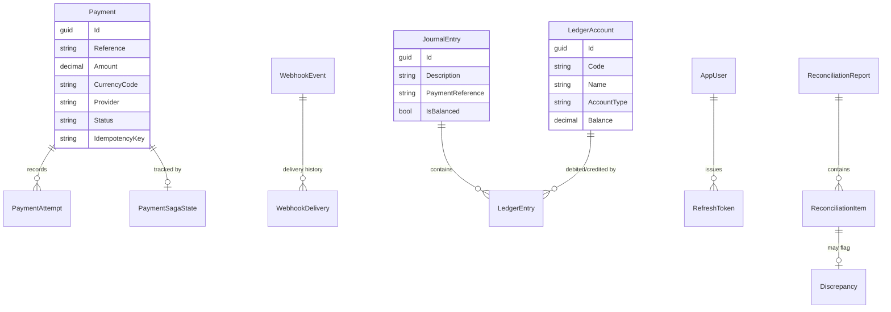

# FinFlow.Orion

A payment processing and reconciliation platform for the Kenyan market. FinFlow.Orion routes payments through **M-Pesa** (STK Push), **Card**, and **Bank Transfer** channels, tracks each payment through its full lifecycle with automatic provider fallback, reconciles internal records against provider statements, and keeps a double-entry accounting ledger of every money movement.

Built as a .NET 10 Clean Architecture / DDD solution: nine deployable/library projects, a MediatR-driven CQRS application layer, an outbox-pattern event pipeline over RabbitMQ, and a Blazor WebAssembly admin console.

---

## What it does

- **Initiates payments** via M-Pesa (Safaricom Daraja STK Push), Card, or Bank Transfer, with idempotency-key protection against duplicate submissions.
- **Falls back automatically** — if a payment fails on M-Pesa, a saga retries it on Card, then Bank Transfer, before giving up.
- **Posts double-entry ledger journals** for every captured or reversed payment, keeping a real chart of accounts in balance.
- **Reconciles** internal payment records against provider-reported transactions on a daily schedule, flagging discrepancies for manual review.
- **Ingests provider webhooks** (e.g. the Daraja STK callback) through a separate, independently-scalable service, with per-provider signature verification.
- **Exposes a versioned REST API** (JWT-secured, OpenAPI/Scalar docs) and a **Blazor admin console** for operating all of the above.

---

## Tech stack

| Layer | Technology |
|---|---|
| Runtime | .NET 10 (preview), C# 13, nullable reference types enabled everywhere |
| API | ASP.NET Core Web API, Asp.Versioning, native .NET OpenAPI + Scalar UI, JWT Bearer auth |
| Application | MediatR 14 (CQRS commands/queries + pipeline behaviors), FluentValidation 12 |
| Persistence | EF Core 10 on SQL Server (two `DbContext`s sharing one database — see [Data model](#data-model)) |
| Messaging | MassTransit 9 + RabbitMQ (requires a MassTransit license — `MT_LICENSE`/`MT_LICENSE_PATH` — at bus-build time, see [Known limitations](#known-limitations--open-design-decisions)) |
| Jobs | Quartz.NET 3.19 (outbox processing every 30s, daily reconciliation) |
| Provider integration | Refit + Polly (M-Pesa Daraja HTTP client); Card/Bank are documented simulator adapters pending a real gateway |
| Document store | MongoDB (raw inbound webhook payload audit trail) |
| Auth | BCrypt password hashing, JWT access + refresh tokens |
| Admin UI | Blazor WebAssembly + MudBlazor |
| Logging | Serilog (console + rolling file, structured) |
| Testing | xUnit, FluentAssertions, NSubstitute, Testcontainers (SQL Server + MongoDB) |
| Infra | Docker Compose (local stack), GitHub Actions CI |

---

## Architecture

Nine projects under `src/`, arranged by Clean Architecture layer. `Domain` has no dependencies; everything else points inward.



**Why Api/Webhooks never touch RabbitMQ directly:** the MassTransit bus (producer + consumers) is registered only in `Workers`. Api and Webhooks write outbox rows inside the same database transaction as their domain changes (`ApplicationDbContext.SaveChangesAsync` does this automatically); `Workers` polls that outbox every 30 seconds and publishes onto the bus. This keeps the request-handling processes free of a RabbitMQ dependency and keeps publishing reliable — a row only exists in the outbox if its originating transaction actually committed.

---

## Payment lifecycle

Card completes synchronously. M-Pesa and Bank Transfer only *submit*, and are confirmed later by the provider's webhook callback.



---

## Saga fallback

When a payment fails, `PaymentFailedIntegrationEvent` reaches a MassTransit consumer in `Workers`, which drives `PaymentSaga` through the fixed fallback chain **M-Pesa → Card → Bank Transfer**. Saga progress is persisted in `PaymentSagaStates` so it survives process restarts.



The saga never mutates a payment directly — it always sends a `RetryPaymentCommand` through MediatR, so every transition still goes through `Payment`'s own state-machine guards.

---

## Data model

Two `DbContext`s share one physical database: `ApplicationDbContext` (payments, webhooks, reconciliation, identity, outbox, saga state) and `LedgerDbContext` (chart of accounts, journals, ledger entries) — kept separate because the ledger is deliberately append-only and audited differently from operational data. Apply both contexts' migrations when setting up a new database (see [Setup](#setup)).



`OutboxMessage` and `IdempotencyRecord` are standalone tables (no FK relationships) that support the reliability patterns described above.

---

## Ledger chart of accounts

Seeded by `LedgerAccountSeeds` (`src/FinFlow.Orion.Ledger/Configurations/LedgerAccountSeeds.cs`). Each captured payment posts a balanced debit/credit pair based on its channel:

| Code | Name | Type | Used for |
|---|---|---|---|
| `1001-MPESA-FLOAT` | M-Pesa Float Account | Asset | Debited on M-Pesa capture |
| `1002-CARD-SETTLE` | Card Settlement Account | Asset | Debited on Card capture |
| `1003-BANK-SETTLE` | Bank Transfer Settlement Account | Asset | Debited on Bank Transfer capture |
| `1004-RECEIVABLE` | Payments Receivable | Asset | Reserved |
| `2001-CUSTOMER-PAYABLE` | Customer Funds Payable | Liability | Credited on every capture |
| `2002-REVERSAL-PAYABLE` | Reversal Payable | Liability | Seeded, **not yet wired** |
| `4001-TRANSACTION-FEE` | Transaction Fee Revenue | Revenue | Seeded, **not yet wired** |
| `5001-PROVIDER-CHARGES` | Payment Provider Charges | Expense | Seeded, **not yet wired** |
| `5002-REVERSAL-COST` | Reversal Processing Cost | Expense | Seeded, **not yet wired** |

Reversals flip the same account pair used for the original capture (via `LedgerService.PostReversalAsync`), rather than using the seeded `2002`/`5002` accounts — see [Known limitations](#known-limitations--open-design-decisions).

---

## Setup

**Prerequisites:** .NET 10 preview SDK, Docker Desktop.

### Option A — Docker Compose (full stack)

```bash
# Required secrets — generate your own, don't reuse these examples:
export MSSQL_SA_PASSWORD='Your_Strong_Passw0rd!'
export JWT_KEY=$(openssl rand -base64 48)
export MT_LICENSE='<your MassTransit license key>'   # required by the workers service — see Known limitations

docker compose up -d --build
```

This starts SQL Server (`localhost:1434`), MongoDB (`localhost:27018`), RabbitMQ (`localhost:5673`, management UI on `15673`), and all four application processes. Host ports are deliberately non-default to avoid colliding with anything already running locally.

Don't have a MassTransit license yet? Bring up everything except `workers`: `docker compose up -d --build sqlserver mongodb rabbitmq api webhooks admin`. Payments still work end-to-end for the synchronous Card path; the outbox-publish/saga-fallback pipeline (which only `workers` drives) won't run until you add one.

Apply migrations against the compose database once the containers are healthy:

```bash
dotnet ef database update --project src/FinFlow.Orion.Infrastructure --startup-project src/FinFlow.Orion.Api --context ApplicationDbContext -- --connection "Server=localhost,1434;Database=FinFlowOrion;User Id=sa;Password=$MSSQL_SA_PASSWORD;TrustServerCertificate=True;"
dotnet ef database update --project src/FinFlow.Orion.Infrastructure --startup-project src/FinFlow.Orion.Api --context LedgerDbContext -- --connection "Server=localhost,1434;Database=FinFlowOrion;User Id=sa;Password=$MSSQL_SA_PASSWORD;TrustServerCertificate=True;"
```

### Option B — Run locally

1. Have a SQL Server instance reachable (LocalDB works out of the box on Windows), MongoDB, and RabbitMQ running.
2. Set the JWT signing key — the committed `appsettings.json` ships an obvious placeholder that fails fast in Production:
   ```bash
   dotnet user-secrets set "Jwt:Key" "<32+ random characters>" --project src/FinFlow.Orion.Api
   ```
3. Apply migrations for both contexts:
   ```bash
   dotnet ef database update --project src/FinFlow.Orion.Infrastructure --startup-project src/FinFlow.Orion.Api --context ApplicationDbContext
   dotnet ef database update --project src/FinFlow.Orion.Infrastructure --startup-project src/FinFlow.Orion.Api --context LedgerDbContext
   ```
4. Run each process: `dotnet run --project src/FinFlow.Orion.Api`, `...Webhooks`, `...Workers`, `...Admin`.

### Smoke test

```bash
# Card completes synchronously:
curl -X POST http://localhost:5233/api/v1/payments \
  -H "Content-Type: application/json" -H "Authorization: Bearer <token>" \
  -d '{"amount":1000,"currencyCode":"KES","provider":"Card","channel":"Web","idempotencyKey":"<16+ char guid>","customerId":"cust-1"}'
# → 201, Status: "Captured"
```

Register/login via `POST /api/v1/auth/register` and `/api/v1/auth/login` to obtain a bearer token first.

---

## Known limitations / open design decisions

- **Card and Bank gateways are honest simulators, not real integrations.** `CardProvider`/`BankProvider` (`src/FinFlow.Orion.Infrastructure/Providers/`) return canned success responses with clearly-marked `TODO`s for a real gateway (Stripe/Flutterwave/Paystack for Card; Pesalink/RTGS/CBK KEPSS for Bank). M-Pesa is the one channel with a genuine Daraja STK Push integration.
- **Bank Transfer account details aren't persisted on the Payment aggregate** — `BankAccountNumber`/`BankCode`/`BankAccountName` are accepted on `InitiatePaymentRequest` and used only at dispatch time. A saga-driven retry that falls back *to* Bank Transfer has no bank details to use and will fail gracefully rather than crash — a real deployment would need a saved-payment-method concept to make this fallback leg functional.
- **Fee and reversal-cost ledger accounts are seeded but unwired** (`4001-TRANSACTION-FEE`, `5001-PROVIDER-CHARGES`, `2002-REVERSAL-PAYABLE`, `5002-REVERSAL-COST`) — no fee schedule exists anywhere in the code, so nothing posts to them yet.
- **The Card/Bank webhook payload contract is a documented placeholder** (`WebhookPayloadParser.ParseSimulated`) — `{ "transactionId", "status", "reference" }` — since neither simulator currently calls back into the Webhooks service. Replace once a real gateway is chosen.
- **MassTransit 9 requires a commercial license key** (`SetLicense` in code, or the `MT_LICENSE`/`MT_LICENSE_PATH` environment variable) even for basic RabbitMQ bus usage — `Workers` will fail to start (`MassTransit.ConfigurationException`) without one. Set `MT_LICENSE` before running Workers locally or via Docker Compose; everything else (Api, Webhooks, the synchronous Card payment path) works without it, since only Workers touches the bus. If a license isn't available, pinning back to the 8.x line (Apache 2.0, no license required) is a straightforward downgrade — `MassTransit`/`MassTransit.RabbitMQ`/`MassTransit.EntityFrameworkCore` have no breaking API changes relevant to this codebase between 8.5 and 9.2.
- **MediatR logs a license warning at startup** — MediatR 14 requires a commercial license for production use (free for development/testing, per the startup warning). Not addressed by this project; budget for a license before a real production deployment, or pin back to a pre-commercial MediatR version.
- **`Microsoft.OpenApi` 2.0.0** (a transitive dependency) has a known high-severity advisory (GHSA-v5pm-xwqc-g5wc) flagged at restore time — track for an upstream fix.

---

## Repository layout

```
src/
  FinFlow.Orion.Domain/           Aggregates, value objects, domain events — no dependencies
  FinFlow.Orion.Contracts/        Wire DTOs and integration events, shared by Api/Admin/Webhooks
  FinFlow.Orion.Application/      MediatR commands/queries, validators, saga, MassTransit consumers
  FinFlow.Orion.Ledger/           Double-entry ledger posting
  FinFlow.Orion.Infrastructure/   EF Core repositories, provider clients, outbox, messaging
  FinFlow.Orion.Api/              Versioned REST API (JWT, OpenAPI/Scalar)
  FinFlow.Orion.Webhooks/         Inbound provider callback ingestion
  FinFlow.Orion.Workers/          Quartz jobs + MassTransit bus/consumers
  FinFlow.Orion.Admin/            Blazor WebAssembly admin console
tests/
  FinFlow.Orion.Domain.Tests/             Unit tests — aggregates, value objects
  FinFlow.Orion.Application.Tests/        Unit tests — handlers, validators, saga, consumers
  FinFlow.Orion.Ledger.Tests/             Unit tests — double-entry posting
  FinFlow.Orion.Infrastructure.Tests/     Integration tests — EF/Mongo against Testcontainers
  FinFlow.Orion.Api.IntegrationTests/     Integration tests — full Api via WebApplicationFactory
```
